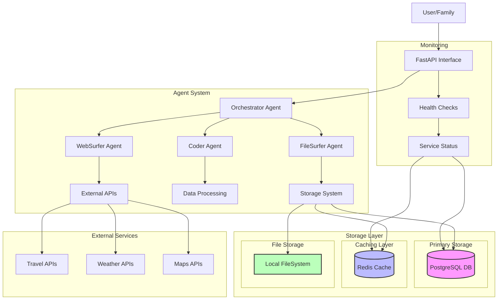
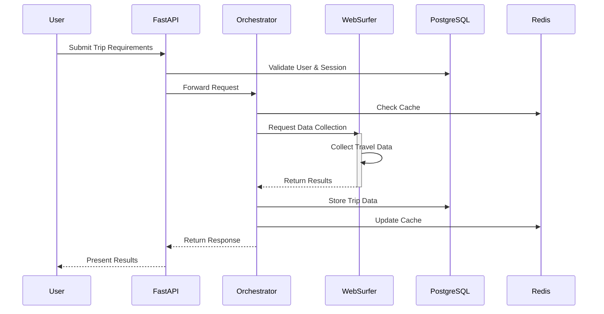
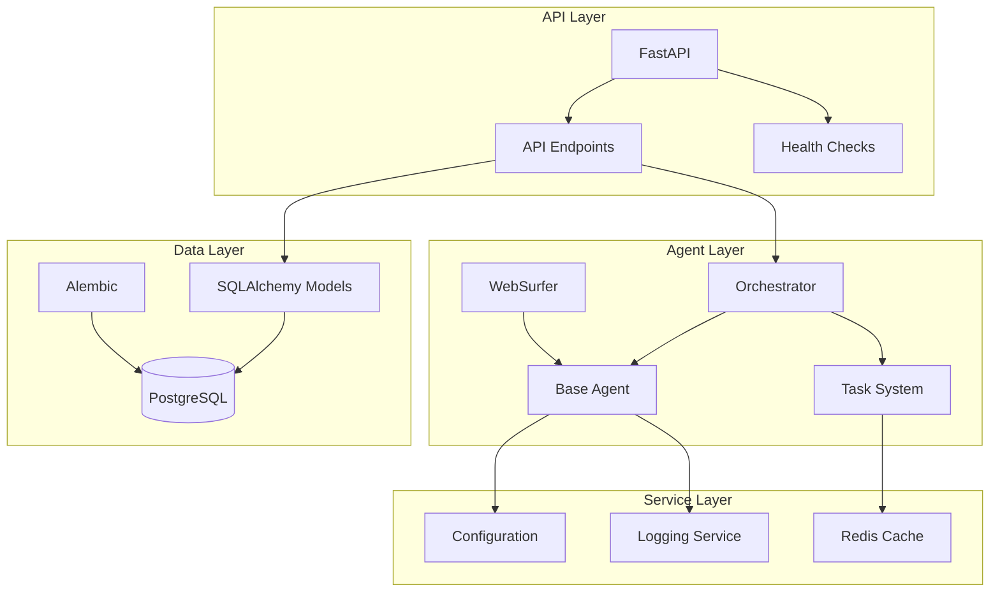
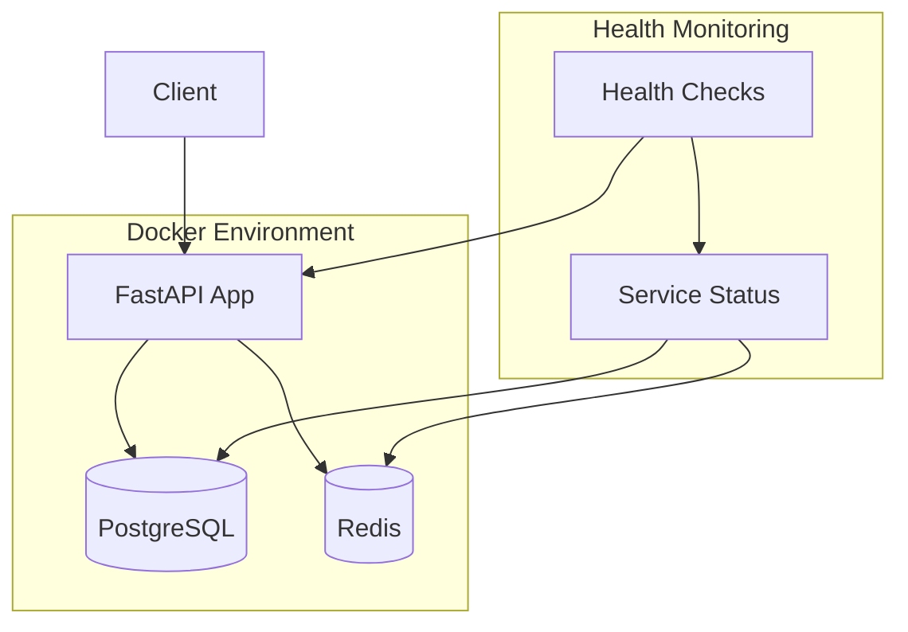
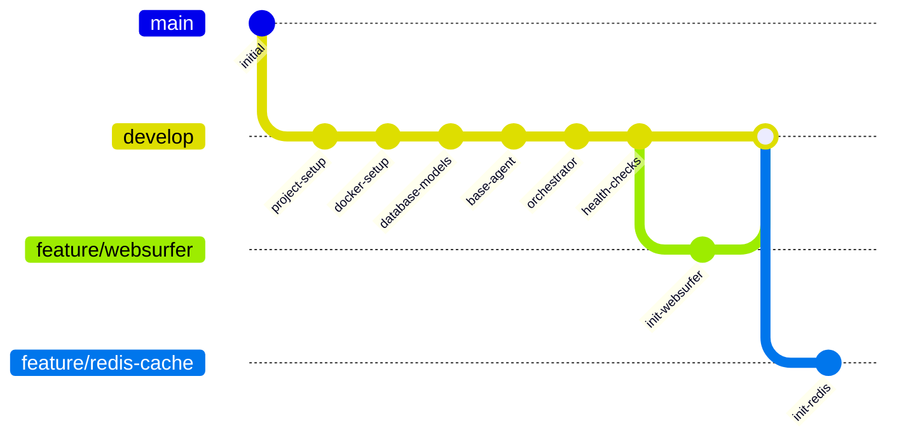

# Architecture Diagrams

## System Overview

## Data Flow

## Component Dependencies

## Deployment Architecture

## Development Workflow

These diagrams provide different views of the system architecture:
1. **System Overview**: Shows the current high-level components and their interactions
2. **Data Flow**: Illustrates the sequence of operations during a typical trip planning process
3. **Component Dependencies**: Details how different components depend on each other
4. **Deployment Architecture**: Shows the current Docker environment setup
5. **Development Workflow**: Reflects our current Git branching strategy and progress

The diagrams will be updated as we implement new features and components. 