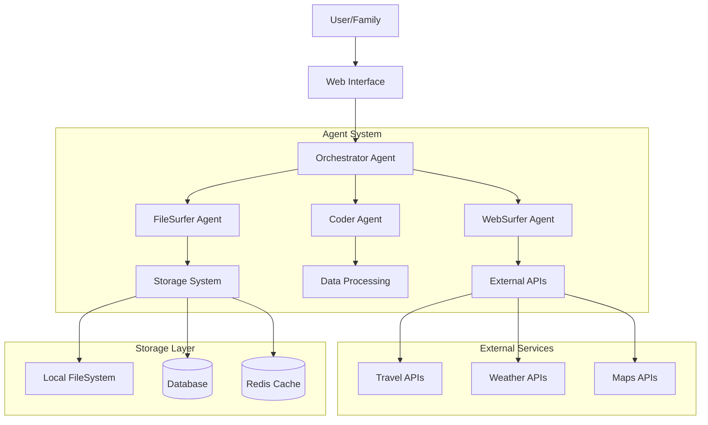
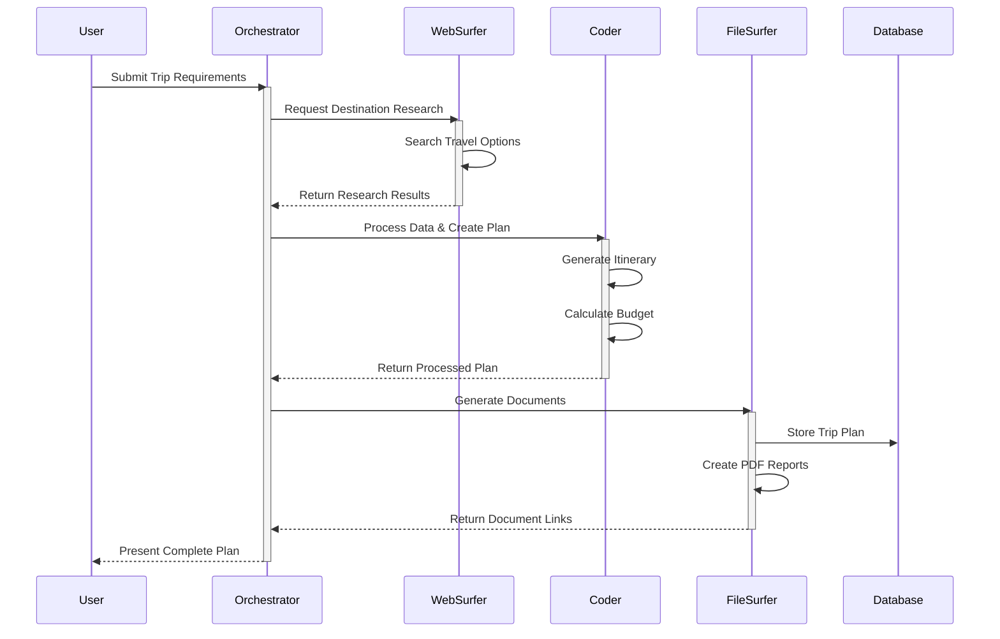
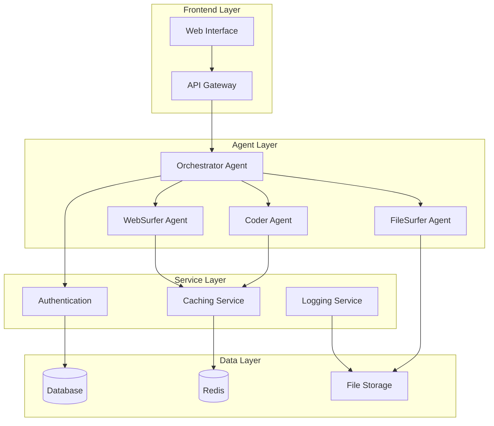
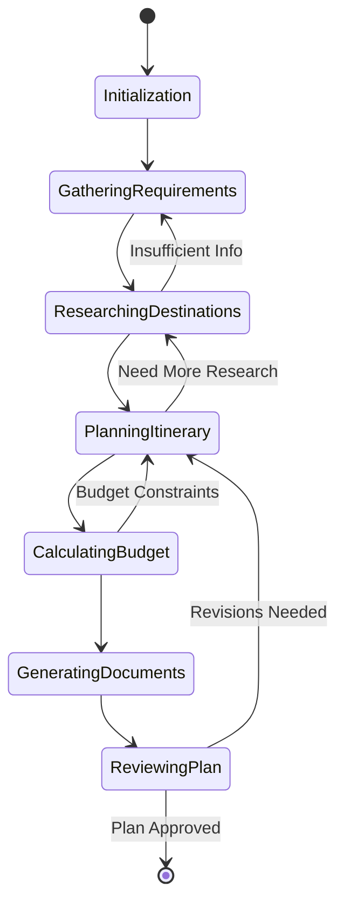
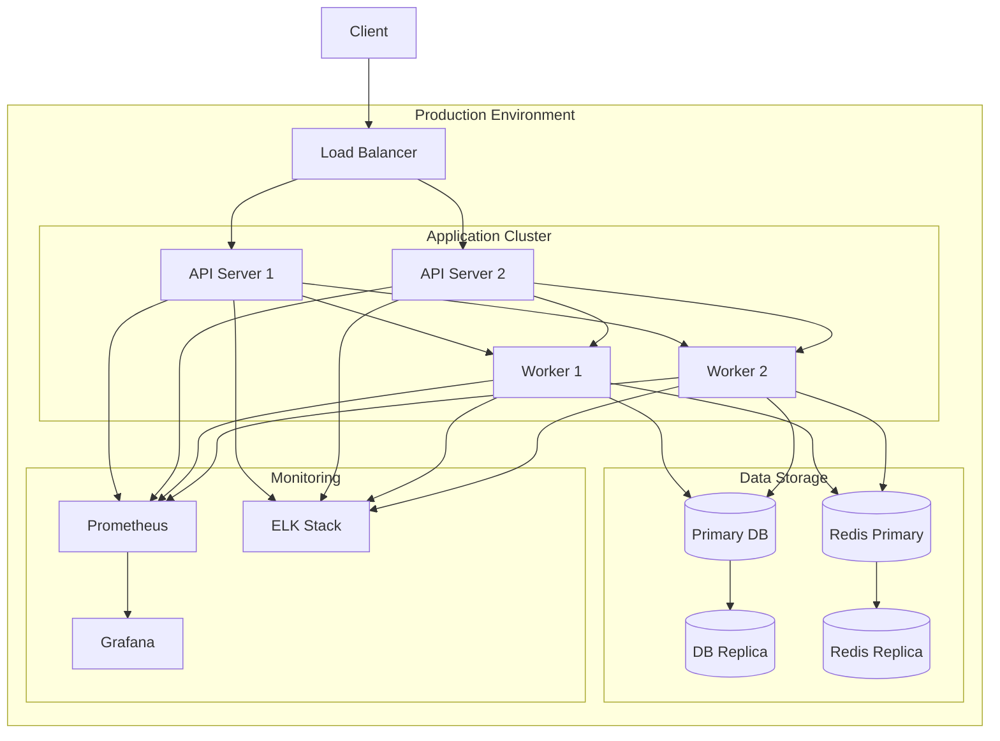
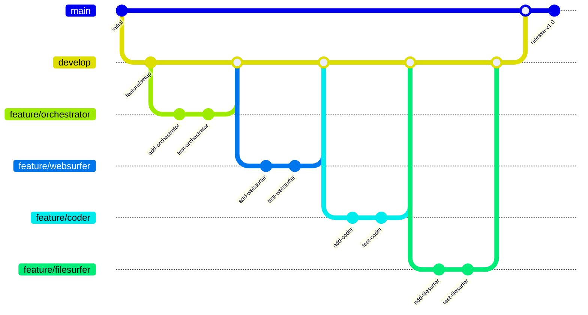

# Architecture Diagrams

## System Overview

## Data Flow

## Component Dependencies

## State Management

## Deployment Architecture

## Development Workflow

These diagrams provide different views of the system architecture:
1. **System Overview**: Shows the high-level components and their interactions
2. **Data Flow**: Illustrates the sequence of operations during a typical trip planning process
3. **Component Dependencies**: Details how different components depend on each other
4. **State Management**: Shows the different states of the trip planning process
5. **Deployment Architecture**: Illustrates the production environment setup
6. **Development Workflow**: Shows the Git branching strategy and development process

The diagrams can be updated as the architecture evolves or requirements change. 